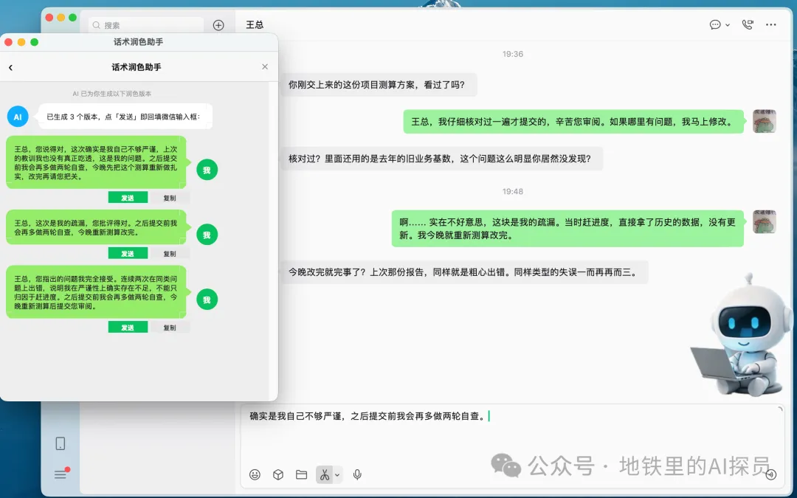
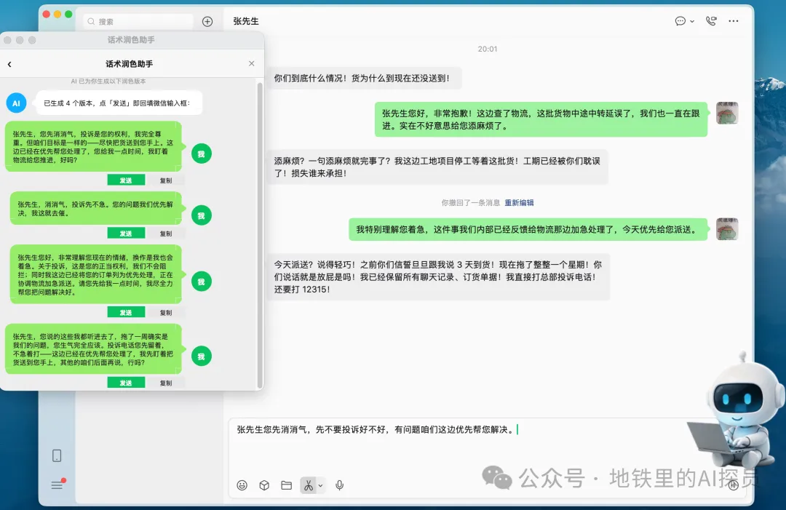
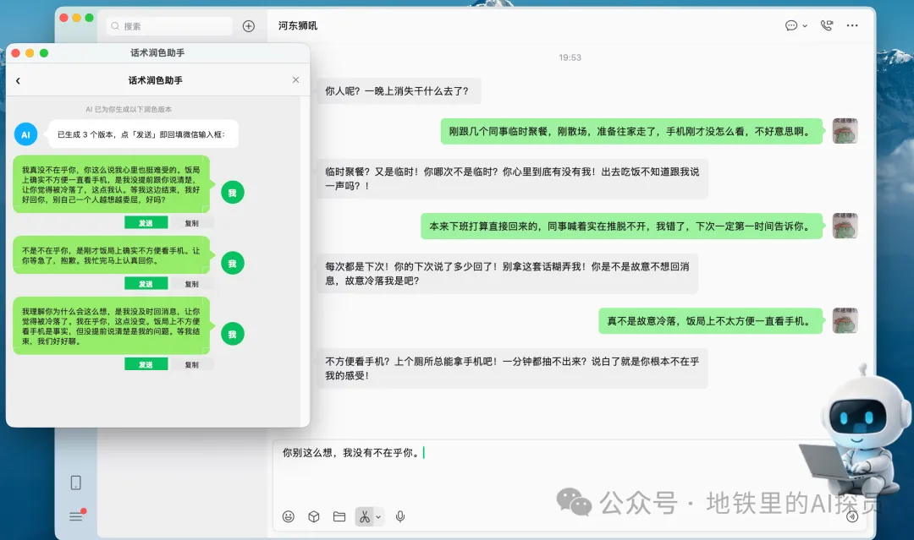

# 话术润色助手 · 使用说明

在微信里打字时，按一个快捷键，AI 就帮你把话术润色成几个版本（或帮你起草回复），选一个自动填回微信输入框。

> ⚠️ **使用前必读（重要）**
> 本程序会**读取当前屏幕上的聊天记录**（通过截图 + 系统 OCR），
> 并把它作为**上下文发送给你自己配置的大模型服务商**。
> **涉及敏感信息时，请勿使用本功能**，以降低信息泄露风险。
> 完整的数据处理方式、高风险场景与责任限制见文末 **《六、免责声明与使用边界》**，
> 开始使用即视为你已阅读并接受。
>
> 同一份说明也可在程序内查看：**右键点击右下角悬浮图标 →「打开设置…」→「使用说明」页签**。

---

## 一、安装与首次启动

### 运行环境

- **macOS 13 或更高**，并已安装、登录 **微信 Mac 版**
- **Python 3.10 或更高**
  （建议用 python.org 或 Homebrew 安装的 3.11/3.12；系统自带的 Python 3.9 配的是旧版 Tk，
  会导致界面画不出来）

### 方式 A：双击启动（推荐）

1. 把整个文件夹放到你喜欢的位置（如「应用程序」或桌面）
2. 双击 **`run-mac.command`**
3. 首次运行会自动创建 `.venv` 并安装依赖，**需要几分钟**，请耐心等待
4. 之后每次双击都会直接启动

> 若提示「无法打开，因为它来自身份不明的开发者」：到 **系统设置 › 隐私与安全性** 点「仍要打开」，
> 或右键该文件选「打开」。也可以在终端里执行 `./run-mac.command`。

### 方式 B：终端运行

```bash
python3 -m pip install -r requirements.txt
python3 main.py
```

### 首次启动必须授权（否则「按了没反应」）

macOS 会拦截截图与按键模拟，下面两项权限**必须手动授予**，否则相关功能会静默失效：

| 权限 | 用来做什么 | 在哪里开 | 何时生效 |
|---|---|---|---|
| **辅助功能** | 读输入框草稿、回填、监听全局热键 | 系统设置 › 隐私与安全性 › 辅助功能 | **立即生效** |
| **屏幕录制** | 截图读取聊天上下文 | 系统设置 › 隐私与安全性 › 录屏与系统录音 | **必须退出并重开程序** |

> **授权时注意两件事（不然很容易卡在「我明明授权了」）：**
>
> 1. 系统设置列表里，本程序显示的名字是 **`话术润色助手`**（就是 App 的文件名），
>    **不是**界面上的中文名「话术润色助手」——照着中文名去列表里找是找不到的。
> 2. 要打开的是那一行**最右侧的开关**。程序里的「去授权」按钮只等于帮你跳到设置页，
>    **不等于已授权**；跳过去之后必须自己把开关拨开。
>
> 另外：权限是**按程序指纹记的**。如果你装过多个副本（比如一份在「应用程序」、
> 另一份在别处），或者重新安装过，都得给**当前正在运行的这一份**重新授权。
> 程序窗口里会显示「当前运行的程序」路径，照着它核对。
>
> 从终端启动（`run-mac.command` / `python3 main.py`）时，权限记在**终端 App**
> （Terminal / iTerm）上，列表里要开的是终端那一项。程序启动时会自动自检并把
> 缺哪一项打印出来。

---

## 二、首次使用：填写 API Key（只需一次）

程序需要调用大模型，所以要一个 **API Key**。请**用你自己的**（新用户有免费额度，日常聊天基本够用）。

**申请步骤：**

1. 打开 <https://platform.deepseek.com/api_keys>
2. 用手机号注册 / 登录
3. 点「创建 API Key」，复制那串以 `sk-` 开头的字符

**填进程序：**

首次启动会自动弹出配置窗口 → 把 Key 粘贴进去 → 建议先点「**测试连接**」确认能用 → 点「**保存并启动**」。

> Key 只保存在你自己电脑的配置文件里（程序目录下的 `config.json`；
> 打包运行时会放到 `~/Library/Application Support/话术润色助手/config.json`），
> 仅用于向你在此处配置的大模型服务商发起请求，不会发给其他任何一方。

---

## 三、日常怎么用

1. 打开**微信 Mac 版**并登录，进入要回复的聊天窗口
2. 在输入框里打几个字（哪怕只打几个关键词）
3. 按 **`Ctrl + Alt + P`**（或点一下右下角的悬浮图标）
4. 稍等 1~2 秒，弹出「优化后语句」窗口，里面有 3 个版本
5. 点「**发送**」→ 自动填回微信输入框（你再按微信的发送键）；点「**复制**」则只复制

**其他操作：**

- **输入框是空的？** 程序会自动切换成「根据聊天上下文帮你起草一条回复」模式
- **想换个说话风格？** 右键点击右下角悬浮图标 →「**打开设置…**」，再点顶部的「**提示词**」页签，
  可以选「商务正式」「简洁高效」「亲切友好」等，还能自己新增
  （有中键的鼠标也可以在任意位置按一下**鼠标中键**打开设置页）
- **右下角悬浮图标**：空闲时是一个图，处理中会变另一个图，直观显示状态
- **挡住东西了？把图标拖走**：按住右下角图标**拖动**到顺手的位置，松手就记住了，
  下次打开还在那儿（拖不出屏幕；万一位置失效会自动回到右下角）。
  **点一下**仍然是「润色」，**拖动**只是移动，两者不会互相误触发

> **关于读取聊天记录 / 上下文（请务必了解）**
>
> 为了让润色更贴合语境，程序会**读取当前屏幕上的聊天记录**，并把它作为**上下文**，
> 连同你输入的草稿，**通过互联网发送给你自己在设置页里配置的大模型服务商**（默认 DeepSeek）：
> - 微信 Mac 版界面**不向系统开放消息内容**，所以程序统一采用
>   **截图 + 系统自带 OCR（Vision 框架）** 来读取，属于图像识别，**可能有少量错别字**。
> - 它抓的是**微信窗口本身**，被别的窗口盖住也能读（最小化会自动还原），
>   不抢焦点、不打断你打字；识别不可用时程序会自动跳过，仍然正常润色。
> - 中文识别模型由 macOS 自带，**无需额外安装语言包**。
>
> 也可以在设置里关掉上下文读取（`config.json` 的 `ocr_context` 设为 `false`），
> 只用输入框里的草稿润色。但请注意：**关闭读取不等于完全本地**——
> 你的草稿本身仍会发送给大模型，这是润色功能的必要前提。
> **当聊天内容涉及敏感信息时，建议直接不要使用本功能**（见文末《六、免责声明与使用边界》）。

### 实际效果（三个真实场景）

**场景 1：给领导认错** —— 测算方案用了去年旧数据被领导点名，草稿写得干巴，
AI 结合上下文生成 3 个版本，挑一个得体又不卑不亢的发出去：



**场景 2：安抚暴怒客户** —— 客户因物流延误扬言投诉 12315，AI 生成 4 个版本，
先稳住情绪、再给明确承诺，把"对骂"变成"解决问题"：



**场景 3：哄对象** —— 女朋友质问"一晚上消失干什么去了"，直男式解释只会火上浇油，
AI 给出 3 个高情商版本，先共情再解释：



### 怎么退出程序？

把鼠标**移到右下角的悬浮图标上悬停**，图标右上角会浮现一个红色 **×** 按钮，点一下就退出。
（鼠标移开后 × 会自动消失，不会挡住图标。）右键菜单里也有退出项。

---

## 四、常见问题

**Q：按热键没反应 / 提示找不到微信？**
- 先在**系统设置 › 隐私与安全性 › 辅助功能**里找到 **`话术润色助手`**（从终端启动时是终端那一项），
  确认它的开关是**打开**的。注意程序名在列表里显示为 `话术润色助手`，不是中文名
- 确认用的是**微信 Mac 版**（手机微信不行），并且已经登录、打开了具体的聊天窗口
- 窗口不要最小化
- 程序会给 10 秒时间等待，期间你可以打开微信；超时才会提示
- 若热键是 `Ctrl + Alt + P`：macOS 上 **Option + 字母**是输入特殊字符的组合键（Option+P 会打出 π），
  个别输入法与键盘布局下会干扰匹配。这时把 `config.json` 的 `hotkey` 改成 **`f8`** 最稳。

**Q：提示「AI 润色失败 / 401」？**
- 说明 API Key 无效或过期，重新去 DeepSeek 生成一个，然后按下面「怎么换 Key」替换

**Q：怎么更换 API Key / 想同时用多个模型？**
- 右键悬浮图标 →「打开设置…」，切到 **「模型与 Key」** 页签：
  1. 在左边点要改的那条配置（没有就点「+ 新增模型」）
  2. 把新的 Key 粘到 **API Key** 输入框（默认是打码的，点右边「**显示**」可以看清）
  3. 点「**测试连接**」确认能用 → 点「**保存**」
- 想同时留几套（比如 DeepSeek 日常 + 豆包备用）：新增一条填好，选中它点「**设为生效**」即可切换。

**Q：想改说话风格 / 换提示词？**
- 同样打开「设置」的「**提示词**」页签，可以编辑内置风格、也能自己新增；
  改完点「保存」，选中它点「**设为生效**」。内置的那几条改坏了可以点「**恢复默认**」。

**Q：想获取更新 / 使用帮助，或者向作者反馈建议？**
- 打开「设置」，切到 **「软件作者」** 页签，里面有两个二维码：
  - **使用交流群**：微信扫码加入，和其它使用者交流用法、反馈问题；
  - **作者微信公众号**：微信扫码关注，获取版本更新、使用帮助与更多支持。
- 二维码点一下可以放大，也会随窗口大小自动调整，小屏同样扫得清。
- 底栏右下角（「关闭」按钮左边）也有「作者微信公众号」「使用交流群」两个快捷入口：
  鼠标悬停会浮出小预览，点一下直接看大图。
- 提醒：**群二维码是微信生成的，约 7 天后会失效**；如果扫码提示过期，找作者要一张新的即可。

> ⚠️ **关于 Key 的安全**：Key 是以**明文**存在你本机的 `config.json` 里的（程序不会加密它）。
> 界面上会打码显示、也不会写进日志，但**请不要把这个文件发给别人或上传到网盘**。

**Q：提示「检测到微信正在运行，但未定位到主窗口」？**
- 微信被最小化或收进程序坞了，把主窗口恢复出来再按热键即可。

**Q：润色结果填不回微信？**
- 触发时把光标放在微信输入框里；程序会把焦点还给微信再输入
- 若微信刚更新过界面，窗口定位可能临时失效，重启一下助手或看 `polish.log`

**Q：提示「AI 润色失败：网络连接失败」？**
- 这条是说程序**没能连上大模型接口**（连接被中断 / TLS 握手失败），和读聊天内容没关系。
  程序遇到这类错误会自动重试一次；仍然失败，基本可以断定是网络环境的问题：
  - 关掉代理、VPN、加速器再试；**必须用代理时，把 `api.deepseek.com` 设为直连**；
  - 公司、校园网络经常拦这类请求 —— 换手机热点验证一下就能确认；
  - 安全软件的「HTTPS 扫描」也会插一脚，临时关掉再试；
  - 确认系统时间准确（时间偏差过大会导致 TLS 握手失败）。
- 如果排查完还是不行，可按下面一条把 `polish.log` 还原成明文**自行检查**；若要发给作者协助排查，
  请先删掉其中的聊天内容——**日志里不含 API Key，但按默认设置会记录提示词与聊天上下文**。

**Q：读到的聊天记录有错别字 / 顺序不太对？**
- 正常现象。微信 Mac 版不向系统开放界面内容，程序只能靠**画面识别**来读，会有少量误差。
  它只是给 AI 提供聊天语境，**以你输入框里的内容为准**。
- 如果完全读不到，多半是**屏幕录制权限**没给（授权后必须退出重开程序），或者窗口处于最小化状态。

**Q：想看它到底发给 AI 了什么？**
- 日志在程序目录下的 `polish.log`（打包运行时在程序安装目录）。
  里面有完整提示词（**含聊天上下文**）和 AI 返回内容。
- **日志是加密保存的**：直接打开是一串密文（每行以 `WPENC1:` 开头），属正常现象——
  这样即使日志文件被别人拿到也看不到内容。看明文用：
  ```bash
  python3 log_decrypt.py            # 还原出 polish.decrypted.log
  ```

**Q：怎么卸载？**
- 删除整个程序文件夹即可（含 `.venv`）。如果你填过 API Key，记得一并删掉 `config.json`。
- 若之前勾选过系统权限，可到「系统设置 › 隐私与安全性」里把对应条目移除。

---

## 五、需要联网吗？

需要。润色请求会发到你自己的账号（用你填的 Key）。**请求内容包含你输入的草稿，
以及开启上下文读取时从当前屏幕读取到的聊天记录**；除此之外程序不联网。

---

## 六、免责声明与使用边界（重要）

**请在使用前完整阅读本节。你开始使用本软件，即视为已阅读、理解并接受以下全部内容。**

### 6.1 数据处理说明：哪些内容会被发出

- 为完成润色，本软件会**读取当前屏幕上的聊天记录**（通过截图 + 系统 OCR 识别文字），
  并把它**作为上下文**，连同你输入的草稿，**通过互联网发送给你自己在设置页里配置的大模型服务商**
  （默认 DeepSeek）。
- 这些内容由该服务商按其自身的隐私政策与用户协议处理、留存，**本软件无法控制、无法删除、也无法撤回**；
  请在使用前自行查阅你所选服务商的相关条款。
- 内容只会发往**你自己配置的**服务地址：本软件**不向任何第三方服务器额外上传**，作者**不会收到**你的聊天内容，
  我方也未设置任何数据收集或统计埋点。
- 本机日志默认**加密保存**，但其中可能包含提示词与聊天上下文；还原出的明文**请勿转发他人**。

### 6.2 敏感信息：建议不要使用本功能

**当聊天内容涉及敏感信息时，建议不要使用本软件的润色（上下文）功能，以降低信息泄露风险。** 包括但不限于：

- 身份证号、护照号、手机号、住址、人脸/照片等个人身份信息；
- 银行账号、卡号、支付信息、交易金额与流水、征信与金融账户信息；
- 密码、验证码、密钥、令牌、API Key 等各类凭据；
- 未公开的合同、报价、财务数据、招投标信息、商业计划；
- 客户资料、内部文档，以及法律法规或合同约定负有保密义务的信息。

> **只要使用润色，你输入的草稿仍会发送给大模型**——最稳妥的做法是：**敏感内容不要使用本软件。**

### 6.3 责任限制

- 本软件为**免费、按「现状（AS IS）」提供**的技术工具，不对其可用性、准确性、稳定性、连续性
  及特定用途适用性作任何明示或默示担保；
- **若因你使用本软件的润色功能（含通过截图识别获取当前屏幕聊天记录、并将其作为上下文发送给所配置的大模型）
  而导致信息泄露、数据丢失、第三方索赔或任何其他损失，本软件及作者不承担任何责任**；
- 因 AI 生成内容不准确、不恰当、被误发或被他方使用而产生的后果，由使用者自行判断并承担；
- 使用者应自行确保：所处理的内容**不侵犯他人隐私权、个人信息权益与商业秘密**，并已取得必要授权
  （**对方的聊天记录同样受法律保护**）；因未取得授权或违反所在单位保密规定而产生的责任，由使用者自行承担；
- 使用者应自行确认其使用行为符合所在地区法律法规、所使用平台（如微信）的服务条款及所在单位的管理规定。

### 6.4 你的选择

**不同意上述任何一条，请立即停止使用并删除本软件。** 你随时可以：

- 直接卸载本软件（见第四节「怎么卸载」）。

---

*本说明最后更新：2026-09-26。内容如与程序实际行为不一致，以程序实际行为为准，并请以最新版本说明为准。*
